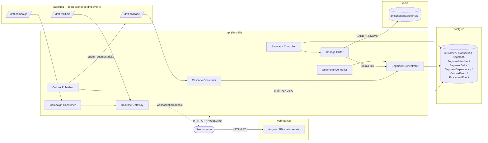
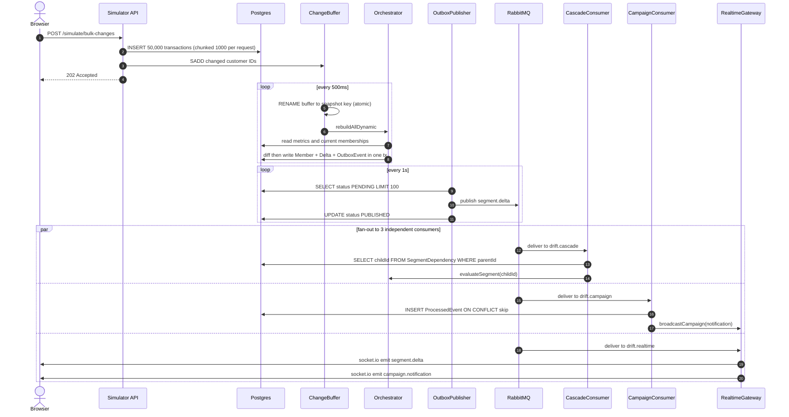
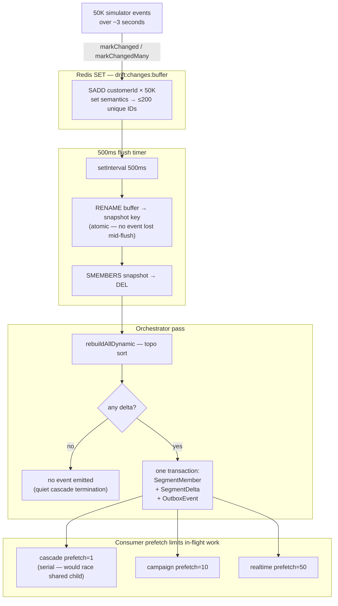
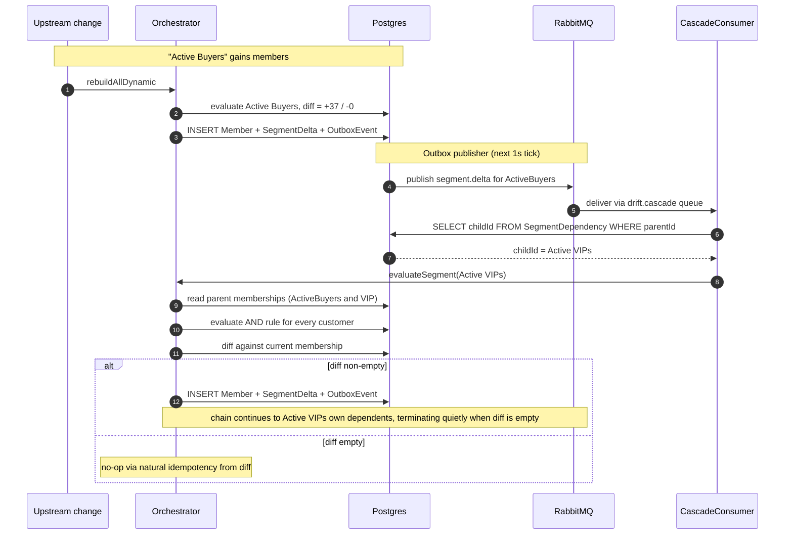
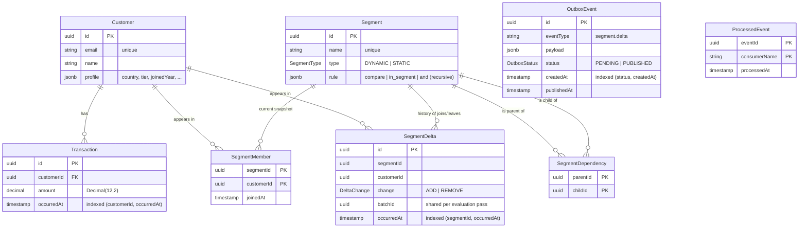

# Drift Happens — Architecture diagrams

Five Mermaid diagrams covering the three spec-mandated views (component
connections, signal path, batch logic) plus two extras (cascade flow, data
model). Every diagram is inline so GitHub renders it automatically — no
external tooling required.

---

## 1. System Architecture — who talks to whom

What each container is and how the moving parts connect. Each subgraph is a
single Docker container; the internal services inside the API container are
NestJS providers that share a process.

---

## 2. Signal Path — one change event end-to-end

What happens between a single simulator action and the UI flash. Time flows
top-to-bottom. The `loop` blocks make the 500ms debouncer and 1s outbox
publisher visible as their own steady cadence.

---

## 3. Backpressure & Debouncing — where 50K events collapse

Why a 50K-event burst doesn't translate to 50K segment evaluations. The
Redis SET deduplicates by customer ID; the 500ms timer further coalesces;
the orchestrator's diff suppresses empty events; consumer prefetch limits
in-flight work.

---

## 4. Cascade Flow — segment A used as filter inside segment B

The spec calls cascading the "special case." This zooms into what happens
when segment A's membership changes and segment B depends on A. The
SegmentDependency table makes the lookup O(indexed-query) instead of
re-parsing every rule.

---

## 5. Data Model — how the persistence shape supports the design

Five tables earn their keep specifically because of the spec's requirements:

- **SegmentMember** — current membership snapshot (the "who's in?" answer).
- **SegmentDelta** — append-only history of every join/leave with a shared
  `batchId` so a consumer can fetch one logical event coherently.
- **SegmentDependency** — materialized cascade graph, so the cascade
  consumer's lookup is one indexed query instead of reparsing every rule.
- **OutboxEvent** — solves the dual-write problem between DB and broker
  (orchestrator writes outbox row inside the membership transaction; a
  separate publisher drains to RabbitMQ — at-least-once delivery).
- **ProcessedEvent** — consumer-side dedup record with composite PK
  `(eventId, consumerName)` so consumers with non-idempotent side effects
  (campaign) can safely run under at-least-once delivery.

